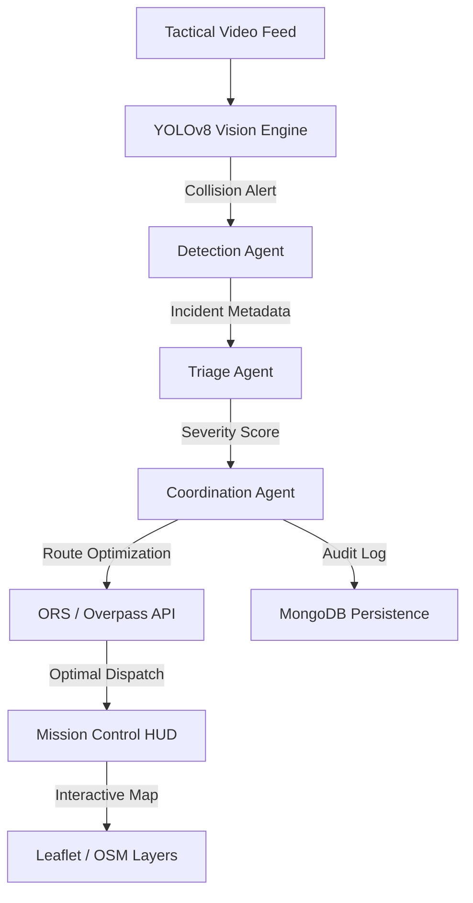

# 🚨 SENTINEL — Agentic Emergency Response System

**SENTINEL** is a mission-critical Agentic AI system designed for autonomous traffic accident detection and real-time emergency response orchestration. By combining computer vision (**YOLOv8**) with a high-fidelity multi-agent coordination pipeline (**Google Gemini 1.5 Flash**), SENTINEL drastically reduces emergency response times by automating detection, triage, and strategic resource dispatching.

---

## 🎥 Demonstration


*Real-time tactical HUD for mission-critical emergency orchestration.*

---

## ✨ Key Features (Sentinel Protocol v2.5)

- **🚀 Tactical HUD UI (Stitch Powered):** A futuristic, high-fidelity React dashboard featuring:
  - **Floating Glass Panels:** Non-colliding status badges and diagnostic readouts with **Glassmorphism 2.0**.
  - **Drone-Style Video Feed:** Real-time YOLOv8 bounding box overlays with tactical scanning effects.
  - **Interactive Full-Screen Map:** Powered by **Leaflet** and integrated as a background layer for global situational awareness.
- **🗺️ Real-Time Intelligence & Routing:**
  - **OpenRouteService (ORS) Integration:** Dynamic ETA calculation and route geometry for the fastest response trajectories.
  - **Automatic Resource Scouting:** Real-time querying of the **Overpass API (OSM)** to identify the nearest specialized medical facilities and emergency agencies.
- **🤖 Agentic Multi-Stage Pipeline:** Orchestrates specialized **Gemini 1.5 Flash** agents:
  - **Detection Agent:** Validates visual evidence and extracts precise incident metadata.
  - **Triage Agent:** Performs clinical severity assessment (1-10 scale) using visual impact and situational context.
  - **Coordination Agent:** Strategically selects optimal facilities based on capability scores, proximity, and traffic-aware ETAs.
- **⚡ Ultra-Low Latency Streaming:** Full-duplex **WebSockets** stream "Agent Thoughts" and telemetry directly to the Mission Control HUD.

---

## 🏗️ System Architecture



---

## 🛠️ Tech Stack

### Backend
- **Framework:** FastAPI (Python 3.10+)
- **LLM Intelligence:** Google Gemini 1.5 Flash
- **Computer Vision:** Ultralytics YOLOv8 + OpenCV
- **Geospatial:** OpenRouteService API + Overpass API (OSM)
- **Database:** MongoDB + In-memory redundancy
- **Communication:** WebSockets (JSON-RPC style)

### Frontend
- **Design System:** Stitch "Sentinel Protocol" (Tactical HUD)
- **Framework:** React 19 + Vite
- **Styling:** Tailwind CSS + Custom CSS Blur Utilities
- **Mapping:** React-Leaflet + Custom HUD Layers
- **Animations:** High-end "Fade & Slide" transitions

---

## ⚙️ Setup & Installation

### 1. Environment Configuration
Create a `.env` file in the **root** folder:
```env
GEMINI_API_KEY=your_google_ai_key
ORS_API_KEY=your_open_route_service_key
MONGODB_URI=mongodb://localhost:27017/  # Optional
YOLO_MODEL_PATH=yolov8n.pt
PORT=8000
```

### 2. Quick Start
```bash
# 1. Backend Setup
cd backend
python -m venv .venv
source .venv/bin/activate  # Windows: .venv\Scripts\activate
pip install -r requirements.txt
python -m uvicorn main:app --reload

# 2. Frontend Setup
cd ../frontend
npm install
npm run dev
```

Visit: **[http://localhost:5173](http://localhost:5173)**

---

## 📂 Project Structure

```text
SENTINEL/
├── backend/
│   ├── main.py             # FastAPI & WebSocket Hub
│   ├── pipeline.py         # Multi-Agent Coordination Pipeline
│   ├── agents/             # Gemini-Powered Specialized Agents
│   │   ├── triage_agent.py
│   │   └── coordination_agent.py
│   ├── utils/              # ORS, Overpass, and YOLO Clients
│   └── database.py         # Persistence Layer
├── frontend/
│   ├── src/
│   │   ├── components/     # Tactical HUD Modules (Map, Log, Video)
│   │   ├── hooks/          # Pipeline Socket Management
│   │   └── index.css       # Sentinel Protocol Theme Tokens
└── demo_videos/            # Simulation footage
```

---

## 📜 License
This project is for demonstration purposes in the context of the SENTINEL emergency response research initiative.

---
*Built with ❤️ for Mission-Critical Engineering.*
